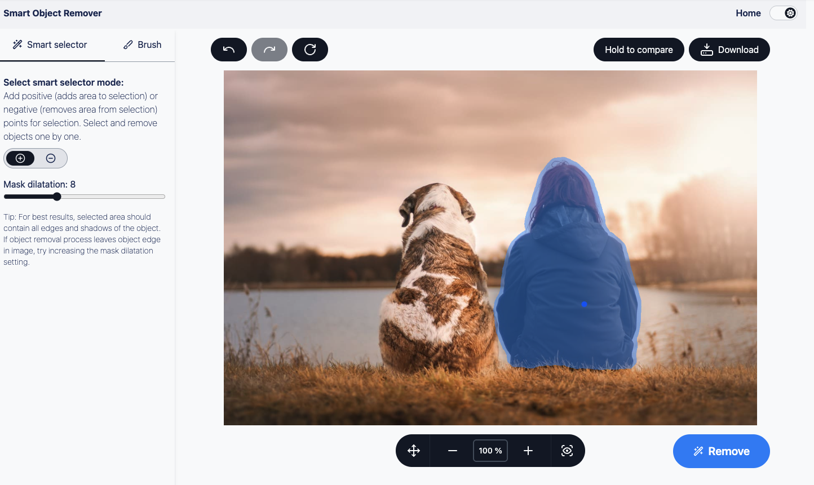
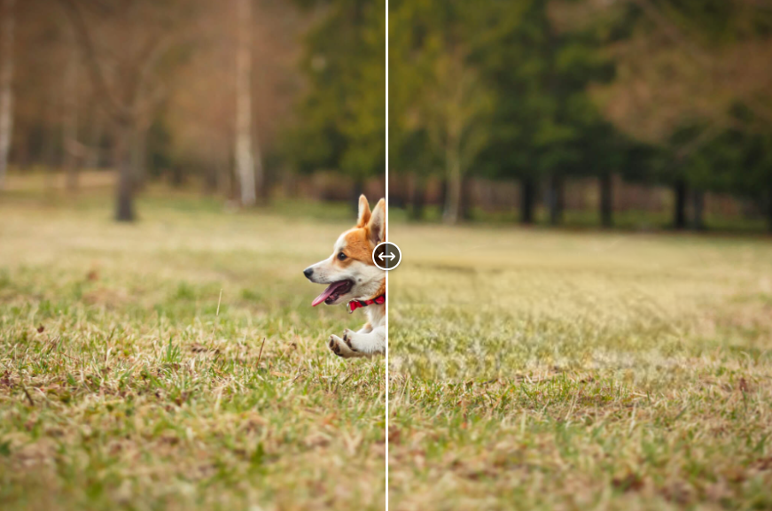

# Smart Object Remover

Browser-based image editor that removes objects from photos — click the object, let it be segmented automatically, hit *Remove*, and the hole is filled in with plausible background.

Everything runs **fully client-side**: two neural networks (MobileSAM for segmentation, MI-GAN for inpainting) execute in the browser through ONNX Runtime Web, on WebGPU where available. No image ever leaves the device and there is no backend.

**Live demo:** https://jkotoun.github.io/dip-image-inpainting-editor/

---

## Screenshots



| One click selects the object | The object is gone |
|---|---|
|  |  |

---

## Features

- **Smart selection** — one click selects a whole object (MobileSAM). Add positive points to grow the selection, negative points to cut parts out.
- **Brush and eraser** — paint the mask by hand where the automatic selection is not what you want, with adjustable brush size.
- **Mask dilation** — the segmentation mask is expanded by a configurable number of pixels, scaled to the image resolution, so edges and shadows get included in the fill.
- **Inpainting** — MI-GAN fills the masked area; the result becomes the working image, so objects can be removed one after another.
- **Undo / redo** across editing steps, plus one-click download of the result.
- **Pan and zoom** canvas (touch and wheel), with zoom controls and reset.
- **Example photos** to try the editor without uploading anything.
- **High-resolution guard** — images with a side longer than 2000 px trigger a prompt offering a downscale, since inference cost grows quickly with resolution.
- **Before/after slider** on the landing page.

## Tech stack

| Layer | Choice |
|---|---|
| Framework | SvelteKit 1 + Svelte 4, TypeScript |
| Styling | Tailwind CSS + Skeleton UI, Lucide icons |
| Inference | ONNX Runtime Web 1.18 (WebGPU, WASM fallback), loaded from jsDelivr |
| Models | MobileSAM encoder + quantized decoder, MI-GAN inpainting pipeline (ONNX, in `static/`) |
| Canvas | `@panzoom/panzoom`, `svelte-compare-image` |
| Build / deploy | Vite, `adapter-static`, GitHub Actions → GitHub Pages |

## How it works

```
image ──► resize to long side 1024 ──► MobileSAM encoder ──► image embedding
                                                                  │
click points ─────────────────────────────► MobileSAM decoder ────┘
                                                   │
                                          binary mask ──► dilation ──► combined with brush mask
                                                                              │
                                    original image + mask ──► MI-GAN ──► inpainted image
```

- **Web worker** — all three ONNX sessions live in `src/workers/mainworker.worker.js` and communicate with the UI through typed messages (`messageTypes.js`), so inference never blocks the canvas.
- **Encode once, decode per click** — the encoder runs once per image (the expensive part); each click only re-runs the lightweight decoder against the cached embedding.
- **Execution providers** — WebGPU is used on desktop with a WASM fallback; mobile browsers are forced to WASM because WebGPU there is still unstable. The decoder always runs on WASM.
- **Lazy inpainter** — the MI-GAN session is created only when it is first needed, so the editor becomes interactive before the heaviest model is ready.
- **Preprocessing** in `src/lib/onnxHelpers.ts` — RGB extraction, NCHW/HWC reshaping and boolean-mask-to-uint8 conversion, all done with plain typed arrays.

### Cross-origin isolation

ONNX Runtime's WASM backend needs `SharedArrayBuffer`, which requires the page to be cross-origin isolated (COOP/COEP headers). Dev is covered by `vite-plugin-cross-origin-isolation`; the deployed static site uses `static/coi-serviceworker.min.js`, registered from `src/app.html`, because GitHub Pages cannot send those headers itself.

---

## Getting started

### 1. Prerequisites

- **Node.js 20+**
- **pnpm 8** (`npm install -g pnpm`) — the lockfile and CI use it; `npm` works too but will ignore `pnpm-lock.yaml`

### 2. Clone and install

```bash
git clone https://github.com/Jkotoun/dip-image-inpainting-editor.git
cd dip-image-inpainting-editor
pnpm install
```

The three ONNX models (~58 MB total) are committed under `static/`, so nothing extra has to be downloaded — expect the clone itself to take a moment.

### 3. Run

```bash
pnpm dev        # dev server at http://localhost:5173
```

Or build and serve the production bundle:

```bash
pnpm build
pnpm preview
```

Use a WebGPU-capable browser (recent Chrome or Edge) for the fast path; anything else falls back to WASM and is noticeably slower. The first model load pulls the ONNX Runtime bundle from jsDelivr, so the initial run needs a network connection.

### Scripts

| Command | What it does |
|---|---|
| `pnpm dev` | Vite dev server |
| `pnpm build` | Static production build into `build/` |
| `pnpm preview` | Serve the production build locally |
| `pnpm check` | `svelte-check` type checking |
| `pnpm lint` | Prettier check + ESLint |
| `pnpm format` | Prettier write |

### Deployment

`.github/workflows/deploy.yaml` builds on every push to `main` and publishes `build/` to GitHub Pages. The site is served from a subpath, so the workflow sets `BASE_PATH=/dip-image-inpainting-editor`, which `svelte.config.js` feeds into SvelteKit's `paths.base`. When hosting elsewhere, set `BASE_PATH` accordingly (empty for a domain root) and make sure the host either sends COOP/COEP headers or keeps the COI service worker in place.

## Project structure

```
src/routes/+page.svelte          landing page — upload, examples, before/after slider
src/routes/editor/+page.svelte   editor UI — canvas, tools, undo/redo, download
src/routes/editor/editorModule.ts  editor state, rendering, mask handling, model calls
src/lib/onnxHelpers.ts           tensor pre/post-processing
src/lib/editorHelpers.ts         mask dilation, canvas helpers, image download
src/workers/                     ONNX worker and its message protocol
src/components/                  navbar, tool selection, zoom controls, step cards
src/stores/                      uploaded image and worker stores
static/                          ONNX models, example photos, COI service worker
```

## Limitations

- Inference is heavy: large images on a WASM-only browser can take tens of seconds and a lot of memory.
- WebGPU is disabled on mobile on purpose — it crashed on some devices — so phones always take the slower path.
- Models are committed to the repository rather than fetched from a release or CDN, which makes the clone large.
- The ONNX Runtime bundle is loaded from jsDelivr at runtime, so the app is not fully offline-capable.
